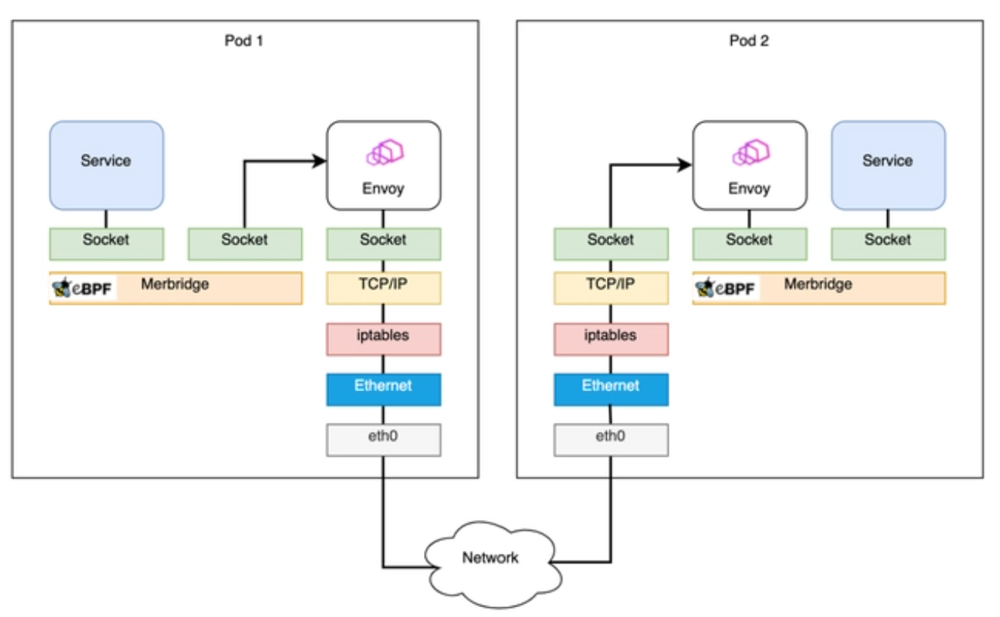

# eBPF 开发实践：使用 sockops 加速网络请求转发

eBPF（扩展的伯克利数据包过滤器）是 Linux 内核中的一个强大功能，可以在无需更改内核源代码或重启内核的情况下，运行、加载和更新用户定义的代码。这种功能让 eBPF 在网络和系统性能分析、数据包过滤、安全策略等方面有了广泛的应用。

本教程将关注 eBPF 在网络领域的应用，特别是如何使用 sockops 类型的 eBPF 程序来加速本地网络请求的转发。这种应用通常在使用软件负载均衡器进行请求转发的场景中很有价值，比如使用 Nginx 或 HAProxy 之类的工具。

在许多工作负载中，如微服务架构下的服务间通信，通过本机进行的网络请求的性能开销可能会对整个应用的性能产生显著影响。由于这些请求必须经过本机的网络栈，其处理性能可能会成为瓶颈，尤其是在高并发的场景下。为了解决这个问题，sockops 类型的 eBPF 程序可以用于加速本地的请求转发。sockops 程序可以在内核空间管理套接字，实现在本机上的套接字之间直接转发数据包，从而降低了在 TCP/IP 栈中进行数据包转发所需的 CPU 时间。

本教程将会通过一个具体的示例演示如何使用 sockops 类型的 eBPF 程序来加速网络请求的转发。为了让你更好地理解如何使用 sockops 程序，我们将逐步介绍示例程序的代码，并讨论每个部分的工作原理。完整的源代码和工程可以在 <https://github.com/eunomia-bpf/bpf-developer-tutorial/tree/main/src/29-sockops> 中找到。
## sockops的调用时机

sockops 会在TCP套接字生命周期中的各种状态变化时被调用，包括但不限于：
 - TCP初始化超时(BPF_SOCK_OPS_TIMEOUT_INIT)
 - TCP窗口初始化(BPF_SOCK_OPS_RWND_INIT)    
 - TCP连接建立(BPF_SOCK_OPS_TCP_CONNECT_CB)    
 - TCP主动连接建立(BPF_SOCK_OPS_ACTIVE_ESTABLISHED_CB)  
 - TCP被动连接建立(BPF_SOCK_OPS_PASSIVE_ESTABLISHED_CB)
 - TCP需要 ECN(BPF_SOCK_OPS_NEEDS_ECN)
 - TCP基础 RTT(BPF_SOCK_OPS_BASE_RTT)
 - TCP超时重传(BPF_SOCK_OPS_RTO_CB)
 - TCP重传(BPF_SOCK_OPS_RETRANS_CB) 
 - TCP状态变化(BPF_SOCK_OPS_STATE_CB)
 - TCP监听(BPF_SOCK_OPS_TCP_LISTEN_CB)
 - TCP RTT(BPF_SOCK_OPS_RTT_CB)
 - TCP解析选项(BPF_SOCK_OPS_PARSE_HDR_OPT_CB)
 - TCP写入选项(BPF_SOCK_OPS_HDR_OPT_LEN_CB)
 - TCP写入选项(BPPF_SOCK_OPS_WRITE_HDR_OPT_CB)

## 利用 eBPF 的 sockops 进行性能优化

网络连接本质上是 socket 之间的通讯，eBPF 提供了一个 [bpf_msg_redirect_hash](https://man7.org/linux/man-pages/man7/bpf-helpers.7.html) 函数，用来将应用发出的包直接转发到对端的 socket，可以极大地加速包在内核中的处理流程。

这里 sock_map 是记录 socket 规则的关键部分，即根据当前的数据包信息，从 sock_map 中挑选一个存在的 socket 连接来转发请求。所以需要先在 sockops 的 hook 处或者其它地方，将 socket 信息保存到 sock_map，并提供一个规则 (一般为四元组) 根据 key 查找到 socket。

Merbridge 项目就是这样实现了用 eBPF 代替 iptables 为 Istio 进行加速。在使用 Merbridge (eBPF) 优化之后，出入口流量会直接跳过很多内核模块，明显提高性能，如下图所示：



```
                      TCP/IP 内核网络栈（被绕过！）
                     ┌─────────────────────────────┐
                     │  socket A         socket B  │
   sendmsg() ──────▶│  ┌──────┐         ┌──────┐  │
   进程 A            │  │ 发送 │ ╳ ╳ ╳   │ 接收  │  │──────▶ recvmsg()
   端口 8000         │  │ 队列 │         │ 队列  │  │         进程 B
                     │  └──┬───┘         └──▲───┘  │         端口 9000
                     └─────┼───────────────┼───────┘
                           │               │
                     ┌─────▼────────────────┴───────┐
                     │     sock_ops_map             │
                     │  ┌──────────────────────┐    │
                     │  │ key: {B,A,9000,8000} │    │
                     │  │ val: socket B ───────┼────│──▶ 直接投递到 B 的 ingress 队列
                     │  └──────────────────────┘    │
                     │  ┌──────────────────────┐    │
                     │  │ key: {A,B,8000,9000} │    │
                     │  │ val: socket A        │    │
                     │  └──────────────────────┘    │
                     └──────────────────────────────┘
```

## 示例程序

此示例程序从发送者的套接字（出口）重定向流量至接收者的套接字（入口），**跳过 TCP/IP 内核网络栈**。在这个示例中，我们假定发送者和接收者都在**同一台**机器上运行。这个示例程序有两个部分，它们共享一个 map 定义：

bpf_sockmap.h

```c
#include "vmlinux.h"
#include <bpf/bpf_endian.h>
#include <bpf/bpf_helpers.h>

#define LOCALHOST_IPV4 16777343

struct sock_key {
    __u32 sip;
    __u32 dip;
    __u32 sport;
    __u32 dport;
    __u32 family;
};

struct {
 __uint(type, BPF_MAP_TYPE_SOCKHASH);
 __uint(max_entries, 65535);
 __type(key, struct sock_key);
 __type(value, int);
} sock_ops_map SEC(".maps");
```

这个示例程序中的 BPF 程序被分为两个部分 `bpf_redirect.bpf.c` 和 `bpf_contrack.bpf.c`。

- `bpf_contrack.bpf.c` 中的 BPF 代码定义了一个套接字操作（`sockops`）程序，它的功能主要是当本机（使用 localhost）上的任意 TCP 连接被创建时，根据这个新连接的五元组（源地址，目标地址，源端口，目标端口，协议），在 `sock_ops_map` 这个 BPF MAP 中创建一个条目。这个 BPF MAP 被定义为 `BPF_MAP_TYPE_SOCKHASH` 类型，可以存储套接字和对应的五元组。这样使得每当本地 TCP 连接被创建的时候，这个连接的五元组信息也能够在 BPF MAP 中找到。

- `bpf_redirect.bpf.c` 中的 BPF 代码定义了一个网络消息 (sk_msg) 处理程序，当本地套接字上有消息到达时会调用这个程序。然后这个 sk_msg 程序检查该消息是否来自本地地址，如果是，根据获取的五元组信息（源地址，目标地址，源端口，目标端口，协议）在 `sock_ops_map` 查找相应的套接字，并将该消息重定向到在 `sock_ops_map` 中找到的套接字上，这样就实现了绕过内核网络栈。

举个例子，我们假设有两个进程在本地运行，进程 A 绑定在 8000 端口上，进程 B 绑定在 9000 端口上，进程 A 向进程 B 发送消息。

1. 当进程 A 首次和进程 B 建立 TCP 连接时，触发 `bpf_contrack.bpf.c` 中的 `sockops` 程序，这个程序将五元组 `{127.0.0.1, 127.0.0.1, 8000, 9000, TCP}` 存入 `sock_ops_map`，值为进程 A 的套接字。

2. 当进程 A 发送消息时，触发 `bpf_redirect.bpf.c` 中的 `sk_msg` 程序，然后 `sk_msg` 程序将消息从进程 A 的套接字重定向到 `sock_ops_map` 中存储的套接字（进程 A 的套接字）上，因此，消息被直接从进程 A 输送到进程 B，绕过了内核网络栈。

这个示例程序就是通过 BPF 实现了在本地通信时，快速将消息从发送者的套接字重定向到接收者的套接字，从而绕过了内核网络栈，以提高传输效率。

bpf_redirect.bpf.c

```c
#include "bpf_sockmap.h"

char LICENSE[] SEC("license") = "Dual BSD/GPL";

SEC("sk_msg")
int bpf_redir(struct sk_msg_md *msg)
{
    if(msg->remote_ip4 != LOCALHOST_IPV4 || msg->local_ip4!= LOCALHOST_IPV4) 
        return SK_PASS;
    
    struct sock_key key = {
        .sip = msg->remote_ip4,
        .dip = msg->local_ip4,
        .dport = bpf_htonl(msg->local_port), /* convert to network byte order */
        .sport = msg->remote_port,
        .family = msg->family,
    };
    return bpf_msg_redirect_hash(msg, &sock_ops_map, &key, BPF_F_INGRESS);
}
```

bpf_contrack.bpf.c

```c
#include "bpf_sockmap.h"

char LICENSE[] SEC("license") = "Dual BSD/GPL";

SEC("sockops")
int bpf_sockops_handler(struct bpf_sock_ops *skops){
    u32 family, op;

 family = skops->family;
 op = skops->op;
 if (op != BPF_SOCK_OPS_PASSIVE_ESTABLISHED_CB
        && op != BPF_SOCK_OPS_ACTIVE_ESTABLISHED_CB) {
        return BPF_OK;
    }

    if(skops->remote_ip4 != LOCALHOST_IPV4 || skops->local_ip4!= LOCALHOST_IPV4) {
        return BPF_OK;
    }

 struct sock_key key = {
        .dip = skops->remote_ip4,
        .sip = skops->local_ip4,
        .sport = bpf_htonl(skops->local_port),  /* convert to network byte order */
        .dport = skops->remote_port,
        .family = skops->family,
    };

 bpf_printk(">>> new connection: OP:%d, PORT:%d --> %d\n", op, bpf_ntohl(key.sport), bpf_ntohl(key.dport));

 bpf_sock_hash_update(skops, &sock_ops_map, &key, BPF_NOEXIST);
    return BPF_OK;
}
```

### 编译 eBPF 程序


```shell
make
```

### 加载 eBPF 程序

```sh
#!/bin/sh
set -x
set -e

mount -t bpf bpf /sys/fs/bpf/

mount -t debugfs none /sys/kernel/debug/

mount -t cgroup2 none /sys/fs/cgroup/


```

```console
# ./sockops_exp
libbpf: loading object 'bpf_contrack_bpf' from buffer
libbpf: elf: section(3) sockops, size 296, link 0, flags 6, type=1

```

### 使用 socat进行测试

运行 [socat]服务器

```shell
socat TCP-LISTEN:8888,fork,reuseaddr -
```

运行 [socat] 客户端

```shell
socat TCP:localhost:8888 -

`````


### 收集追踪

查看``sock_ops``追踪本地连接建立

```console
$ ./trace_bpf_output.sh # 实际上就是 sudo cat /sys/kernel/debug/tracing/trace_pipe

# cat /sys/kernel/debug/tracing/trace_pipe
socat-236     [000] ...11  5415.077139: bpf_trace_printk: >>> new connection: OP:4, PORT:35740 --> 8888

socat-236     [000] ..s31  5415.077206: bpf_trace_printk: >>> new connection: OP:5, PORT:8888 --> 35740

```

当iperf3 -c建立连接后，你应该可以看到上述用于套接字建立的事件。如果你没有看到任何事件，那么 eBPF 程序可能没有正确地附加上。

此外，当``sk_msg``生效后，可以发现当使用 tcpdump 捕捉本地lo设备流量时，只能捕获三次握手和四次挥手流量，而iperf数据流量没有被捕获到。如果捕获到iperf数据流量，那么 eBPF 程序可能没有正确地附加上。

```console
$ ./trace_lo_traffic.sh # tcpdump -i lo port 5001

# 三次握手
13:24:07.181804 IP localhost.46506 > localhost.5001: Flags [S], seq 620239881, win 65495, options [mss 65495,sackOK,TS val 1982813394 ecr 0,nop,wscale 7], length 0
13:24:07.181815 IP localhost.5001 > localhost.46506: Flags [S.], seq 1084484879, ack 620239882, win 65483, options [mss 65495,sackOK,TS val 1982813394 ecr 1982813394,nop,wscale 7], length 0
13:24:07.181832 IP localhost.46506 > localhost.5001: Flags [.], ack 1, win 512, options [nop,nop,TS val 1982813394 ecr 1982813394], length 0

# 四次挥手
13:24:12.475649 IP localhost.46506 > localhost.5001: Flags [F.], seq 1, ack 1, win 512, options [nop,nop,TS val 1982818688 ecr 1982813394], length 0
13:24:12.479621 IP localhost.5001 > localhost.46506: Flags [.], ack 2, win 512, options [nop,nop,TS val 1982818692 ecr 1982818688], length 0
13:24:12.481265 IP localhost.5001 > localhost.46506: Flags [F.], seq 1, ack 2, win 512, options [nop,nop,TS val 1982818694 ecr 1982818688], length 0
13:24:12.481270 IP localhost.46506 > localhost.5001: Flags [.], ack 2, win 512, options [nop,nop,TS val 1982818694 ecr 1982818694], length 0
```

### 卸载 eBPF 程序
软件退出时自动卸载 eBPF 程序。

## 参考资料

最后，如果您对 eBPF 技术感兴趣，并希望进一步了解和实践，可以访问我们的教程代码仓库 <https://github.com/eunomia-bpf/bpf-developer-tutorial> 和教程网站 <https://eunomia.dev/zh/tutorials/>

- <https://github.com/zachidan/ebpf-sockops>
- <https://github.com/merbridge/merbridge>

> 原文地址：<https://eunomia.dev/zh/tutorials/29-sockops/> 转载请注明出处。
